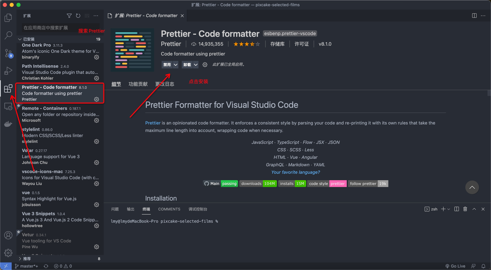
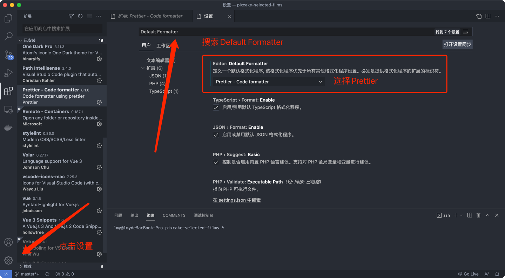
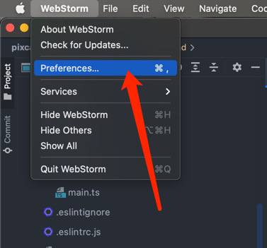
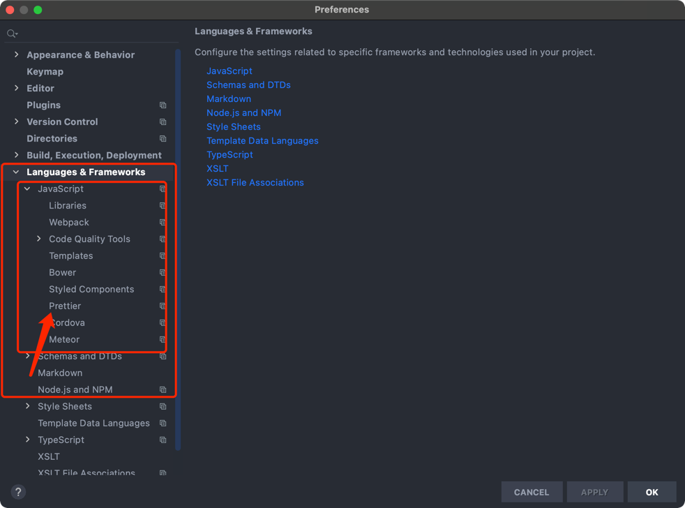
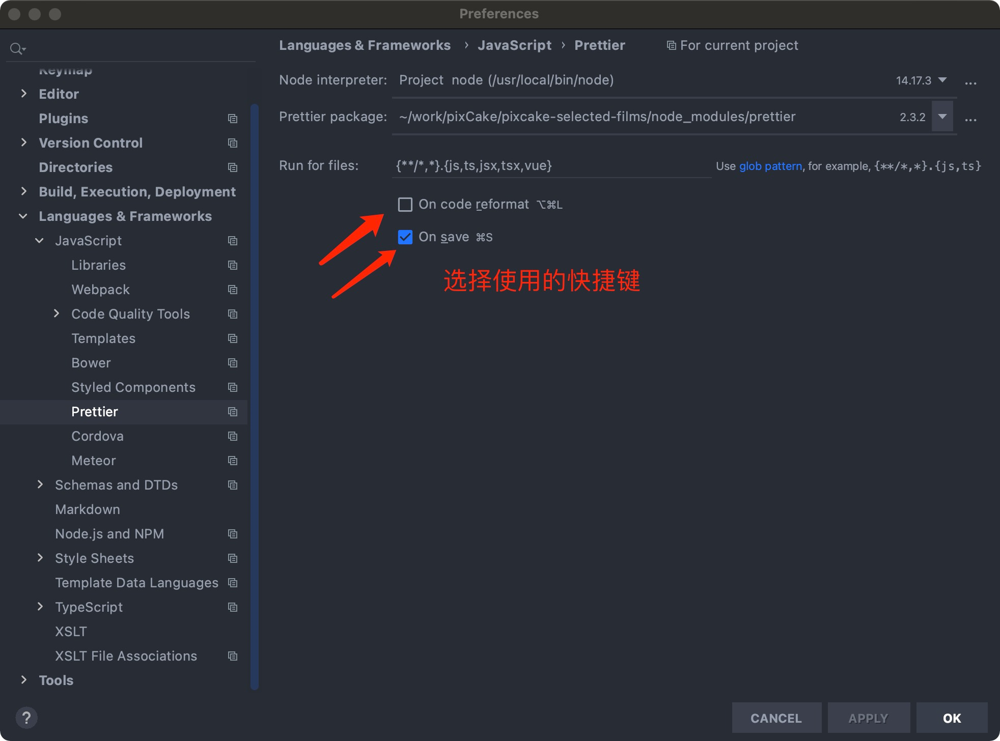

# Vue 3 + Typescript + Vite2

这个模板可以帮助你开始使用Vue 3和Vite中的Typescript进行开发。
>tip:  
> 使用模板后，将可将该文件和.markdown文件夹删除，再另起一个README.md文件。

## 推荐的IDE工具

- [VSCode](https://code.visualstudio.com/) + [Volar](https://marketplace.visualstudio.com/items?itemName=johnsoncodehk.volar)
- [WebStorm](https://www.jetbrains.com/webstorm/)

### 一、VSCode + Volar的格式化快捷键

1.下载Prettier插件 

2.设置Prettier为格式化程序

3.使用的快捷键

~~~  
shift + alt + f
~~~

### 二、WebStorm的格式化快捷键
1.打开Preferences设置
s

2.点击Language & Frameworks --> 点击JavaScript --> 点击Prettier 

3.点击配置prettier文件 --> 在Run for files 中添加vue --> 点击Apply即可

4.选择使用的快捷键

